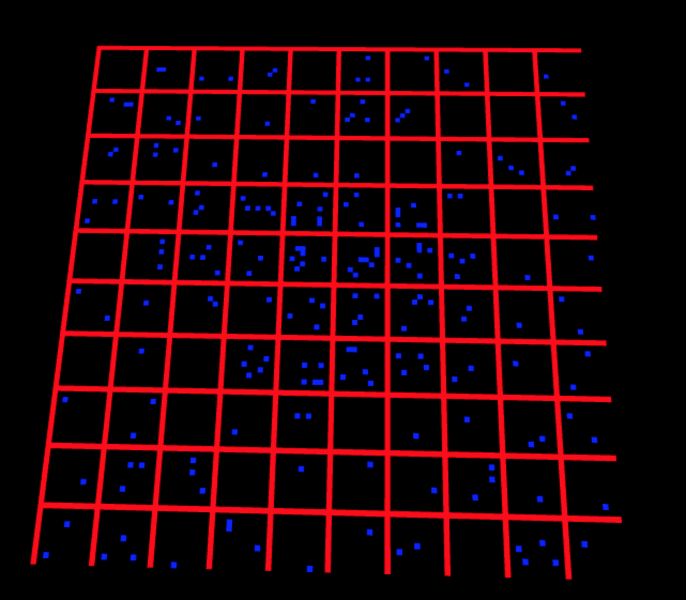

# City Generation by Annie Su (anniesu1)

## Demo
[Link](https://anniesu1.github.io/city-generation/)

## Final result

## Implementation Details
__3D Model of Terrain__

- Terrain map (or elevation map) was generated using perlin noise. Heights are clamped in the range of [-20, -0.99] to ensure the
plane is situated below the road network (consider -1.0 to be the origin). For heights below -0.99, the terrain is
water and is colored blue. 

__"Rasterization"__
- I drew roads using a simple, 90 degrees rotated square such that it lies flat on the plane. Roads follow a simple grid rule and
are rasterized as instance rendered grey squares. The city grid is encapsulated as a `CityGrid` object, which stores grid
information and has helper methods to return VBO data relevant to rendering the grid. 
After laying down the roads, per grid cell `(i, j)`, a noise value is generated. 
At position `(i, j)`, if all the following criteria are satisfied:
  * Noise value is above a __threshold__
  * There is no road at `(i, j)`
  * There are no neighboring roads or existing buildings
  * There is no water

  then a building is placed at `(i, j)`. In the image below, I place a blue square for each
valid position of buildings. The aforementioned __threshold__ is scaled based on population: for a higher population,
the threshold is lower. The population is a simple falloff from the 
center of the grid—the city center has the highest population and the outskirts have lowest population. 

__Building Geometry__
- Building geometry is generated according to the paper titled 
[Real-time Procedural Generation of 'Pseudo Infinite' Cities](procedural_infinite_cities.pdf). Cycling through the
grid in our `CityGrid`, for each grid cell that has demarcated a building, a `Building` object is 
instantiated with its own position, the grid size, and a random rotation angle. The underlying mesh for a `Building` is a 
`Cube.` 
- The `Building`'s initial height is linearly proportional to population (which is 
determined by distance from the center, and is then jittered by noise), and then it is jittered by a noise 
value to obtain non-uniform building heights, i.e. both the population and building heights are perturbed by a noise value. 
In 3 iterations (or until the building reaches the floor), successive lower wings to the building are created with their
own random rotation angles. Each wing is its own instance of the `Cube` mesh.
- Finally, `Building` meshes are scaled based on height/building type. There are 3 building classifications: 
tall, medium, and short height. Tall and medium height buildings have a slight x-scale such that the building does not appear
perfectly cubular. Short buildings have a scaledown in the y-direction and scale up in the x and z-direction, so that short
buildings appear more like stout houses. The `Building` class has a helper function `getTransforms()` that returns the 
transformation matrices of all the `Cube`'s that comprise the `Building.` The VBO data is generated in the `CityGrid` and 
passed to `main.ts` to render.

__Building Shader__
- I created a vertex and fragment shader for the buildings. Each of the three building types (tall, medium, short) has its 
own pre-assigned `fs_Col.` In the fragment shader, a procedural window texture is applied to the buildings. 
Using a check for the x, y position per fragment, if the x, y position fall within a valid window width/height constraint,
then a window color is set. Else, the fragment takes the color of `fs_Col.` I case on the building heights and each of the
three building variants has a slightly different window pattern, which is varied by the window height, width, and frequency.

__Lighting__
- Following [IQ's article on artistic lighting](http://iquilezles.org/www/articles/outdoorslighting/outdoorslighting.htm), 
I applied lambertian lighting to the geometry in the fragment shader with two lights, to ensure that the scene has adequate 
illumination. I tried to add specularity, but it isn't clear that there is indeed specularity (I think it is hard to distinguish
since the mesh is only 4-sided cubes). 

__Sky Shader__
- The sky is generated using a simple mix function between defined heights. I wanted a pastel, dusky sky to match the
pastel city. Clouds are generated and animated using perlin noise and a time variable. 

__Extra Visual Polish__
- Animation: The lights for the buildings flicker on and off based off of a triangle wave that takes as input a time
variable). 
- Vignetting: calculated simply by scaling the color brightness by distance from the center of the screen.

### Improvements
- I would like to generate more interesting building geometry by using 4, 5, and 6-sided polygons 
(cycling through the three options randomly).

## Resources
- [Real-time Procedural Generation of 'Pseudo Infinite' Cities](procedural_infinite_cities.pdf)
- [IQ's article on artistic lighting](http://iquilezles.org/www/articles/outdoorslighting/outdoorslighting.htm)
- [How to accumulate multiple light contributions](https://en.wikibooks.org/wiki/GLSL_Programming/GLUT/Multiple_Lights)
- [Checkerboard pattern in shader](https://stackoverflow.com/questions/4694608/glsl-checkerboard-pattern)
- [Inspiration from ShaderToy](https://www.shadertoy.com/view/tdjSWR)
